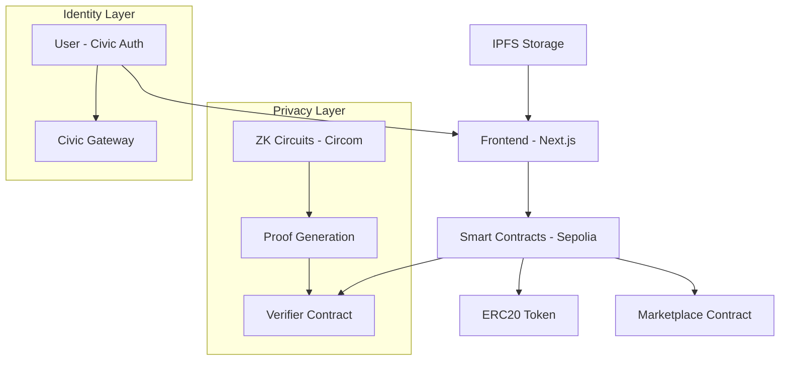

# ZK Civic Carbon: Decentralized Carbon Credit Marketplace
## Powered by Civic Auth & Zero-Knowledge Proofs


---


## 🌍 Executive Summary


ZK-Carbon is a **fully decentralized carbon credit marketplace** deployed on Ethereum Sepolia, leveraging **Civic Auth** for seamless, MetaMask-free authentication and **zero-knowledge proofs (ZKPs)** for privacy-preserving climate finance. Our platform eliminates traditional barriers in carbon markets by providing secure, private, and verifiable climate action infrastructure.

### 🚀 Live Deployment (Sepolia Testnet)
- **Verifier Contract**: [`0xA8A8BfFf718eB5496C9d6c44b8529d0064fc2742`](https://sepolia.etherscan.io/address/0xA8A8BfFf718eB5496C9d6c44b8529d0064fc2742)
- **CarbonCredit ERC20**: [`0x58836b1F5F8D495199791E5396EA066df7661040`](https://sepolia.etherscan.io/address/0x58836b1F5F8D495199791E5396EA066df7661040)
- **Marketplace Contract**: [`0x01ad9Ea4DA34c5386135951a50823eCaC3ec3Ec5`](https://sepolia.etherscan.io/address/0x01ad9Ea4DA34c5386135951a50823eCaC3ec3Ec5)

---

## 🎯 The Problem We Solve

The traditional carbon credit market faces critical challenges:

| Challenge | Impact | Our Solution |
|-----------|--------|--------------|
| **Verification Crisis** | $2B+ in fraudulent credits annually | ZK-Proofs + On-chain verification |
| **Privacy Barriers** | Companies avoid disclosure of emissions data | Zero-knowledge privacy preservation |
| **Access Friction** | Complex wallet setup deters adoption | Civic Auth - no MetaMask required |
| **Trust Deficit** | Centralized intermediaries control flow | Fully decentralized smart contracts |
| **Market Fragmentation** | Isolated trading platforms | ERC20 tokenization + DeFi compatibility |

---

## 🔐 Civic Auth Integration: Web2 UX, Web3 Security

### Why Civic Auth?
Traditional Web3 onboarding creates massive friction - users need to:
- Install MetaMask
- Secure seed phrases
- Understand gas fees
- Navigate complex wallet interfaces

**Civic Auth eliminates these barriers** while maintaining full decentralization.

### Key Benefits:
- ✅ **No MetaMask Required** - Users authenticate with email/phone
- ✅ **Enterprise Ready** - Familiar login flows for corporate users
- ✅ **Identity Verification** - Built-in KYC/compliance features
- ✅ **Mobile First** - Seamless mobile experience
- ✅ **Recovery Options** - Social recovery without seed phrases

### Implementation:
```javascript
import { CivicAuth } from '@civic/auth';

// Initialize Civic Auth
const civicAuth = new CivicAuth({
  gatewayToken: process.env.CIVIC_GATEWAY_TOKEN,
  chain: 'ethereum-sepolia'
});

// Authenticate user without MetaMask
const authenticate = async () => {
  const { user, wallet } = await civicAuth.login();
  // User is now authenticated with auto-generated wallet
  return { address: wallet.address, user };
};
```

---

## 🔒 Zero-Knowledge Proofs: Privacy Without Compromise

### The Privacy Dilemma
Organizations need to prove:
- Carbon credit eligibility
- Emissions reduction achievements
- Financial creditworthiness
- Compliance with standards

**Without revealing**:
- Actual emissions data
- Financial details
- Operational secrets
- Competitive information

### Our ZK Solution
Using **Circom circuits** and **SNARKJS**, we enable:

```circom
template CarbonCreditEligibility() {
    signal private input emissions;
    signal private input reductions;
    signal private input financialScore;
    
    signal output isEligible;
    signal output eligibilityScore;
    
    // Prove eligibility without revealing actual values
    component eligibilityCheck = GreaterThan(64);
    eligibilityCheck.in[0] <== reductions;
    eligibilityCheck.in[1] <== emissions * 10 / 100; // 10% reduction threshold
    
    isEligible <== eligibilityCheck.out;
    eligibilityScore <== reductions * 100 / emissions;
}
```

---

## Architecture Overview



---

## Core Features

### 🏢 Organization Profiles
Each organization maintains a ZK-protected profile:

```solidity
struct Organisation {
    string name;
    string description;
    string profilePhotoipfsHashCode;
    address walletAddress;
    uint256 timesBorrowed;
    uint256 timesLent;
    uint256 totalCarbonCreditsLent;
    uint256 totalCarbonCreditsBorrowed;
    uint256 totalCarbonCreditsReturned;
    uint256 emissions;           // Private via ZKP
    uint256 reputationScore;     // Derived via ZKP
}
```

###  Carbon Credit Claims
Organizations can claim credits by:
1. Submitting proof of emissions reduction
2. Providing ZK-proof of eligibility
3. Community voting on validity
4. Automatic token minting upon approval

###  Lending & Borrowing
- **Collateral-free lending** based on reputation scores
- **ZK-verified creditworthiness** without data exposure
- **Automated repayment** with interest calculations
- **DeFi integration** for yield farming

###  Decentralized Governance
- Community voting on credit claims
- Reputation-based voting weight
- Transparent yet private decision making

---

## 🛠️ Getting Started

### Prerequisites
- Node.js 18+
- Git
- Civic Auth API Key

### Installation

```bash
# Clone the repository
git clone https://github.com/your-username/zk-carbon
cd zk-carbon

# Install dependencies
npm install

# Install Circom and related tools
npm install -g circom snarkjs

# Set up environment variables
cp .env.example .env.local
```

### Environment Configuration

```bash
# .env.local
NEXT_PUBLIC_CIVIC_GATEWAY_TOKEN=your_civic_gateway_token
NEXT_PUBLIC_SEPOLIA_RPC_URL=https://sepolia.infura.io/v3/your_key
NEXT_PUBLIC_MARKETPLACE_ADDRESS=0x01ad9Ea4DA34c5386135951a50823eCaC3ec3Ec5
NEXT_PUBLIC_TOKEN_ADDRESS=0x58836b1F5F8D495199791E5396EA066df7661040
NEXT_PUBLIC_VERIFIER_ADDRESS=0xA8A8BfFf718eB5496C9d6c44b8529d0064fc2742
```

### Running the Application

```bash
# Start development server
npm run dev

# Build for production
npm run build

# Run tests
npm test
```

---

## 🔧 Smart Contract Interaction

### Creating a Carbon Credit Claim

```javascript
import { ethers } from 'ethers';

const createClaim = async () => {
  const marketplace = new ethers.Contract(
    MARKETPLACE_ADDRESS,
    MARKETPLACE_ABI,
    signer
  );

  const tx = await marketplace.createClaim(
    demandedCredits,
    votingEndTime,
    description,
    latitude,
    longitude,
    proofIPFSHashes
  );

  await tx.wait();
  console.log('Claim created successfully');
};
```

### ZK-Proof Generation & Verification

```javascript
import { groth16 } from 'snarkjs';

const generateProof = async (emissions, reductions) => {
  const input = {
    emissions: emissions,
    reductions: reductions,
    threshold: 1000
  };

  const { proof, publicSignals } = await groth16.fullProve(
    input,
    "circuits/eligibility.wasm",
    "circuits/eligibility_final.zkey"
  );

  return { proof, publicSignals };
};

const verifyAndSubmit = async (proof, publicSignals) => {
  const tx = await marketplace.createLendRequest(
    lenderAddress,
    carbonCredits,
    interestRate,
    proof.pi_a,
    proof.pi_b,
    proof.pi_c,
    publicSignals
  );

  await tx.wait();
};
```

---

## 📱 User Experience Flow

### 1. Authentication (Civic Auth)
```
User Login → Civic Identity Verification → Auto-Wallet Generation → Dashboard Access
```

### 2. Organization Onboarding
```
Profile Creation → Emissions Data Input → ZK-Proof Generation → Reputation Score Calculation
```

### 3. Credit Claiming
```
Project Submission → ZK-Eligibility Proof → Community Voting → Token Minting
```

### 4. Lending/Borrowing
```
Loan Request → ZK-Creditworthiness Proof → Lender Approval → Token Transfer
```

---

##  Testing

### Unit Tests
```bash
# Smart contract tests
cd contracts
forge test

# Frontend tests
npm run test:frontend

# ZK circuit tests
npm run test:circuits
```

### Integration Testing
```bash
# Full flow testing
npm run test:integration

# Civic Auth testing
npm run test:civic-auth
```

---

## Security Considerations

### Smart Contract Security
- ✅ **Reentrancy Protection** - OpenZeppelin ReentrancyGuard
- ✅ **Access Control** - Role-based permissions
- ✅ **Integer Overflow** - SafeMath operations
- ✅ **Front-running Protection** - Commit-reveal schemes

### ZK-Proof Security
- ✅ **Trusted Setup** - Ceremony-based parameter generation
- ✅ **Circuit Auditing** - Formal verification of constraints
- ✅ **Proof Validation** - On-chain verifier contracts
- ✅ **Input Validation** - Range checks and boundary conditions

### Civic Auth Security
- ✅ **Identity Verification** - Multi-factor authentication
- ✅ **Wallet Custody** - Secure key management
- ✅ **Session Management** - Token-based authentication
- ✅ **Recovery Mechanisms** - Social recovery options

---

## 🌱 Roadmap

### Phase 1: Foundation (Q1 2024) 
- [x] Core smart contracts deployment
- [x] ZK circuit implementation
- [x] Civic Auth integration
- [x] Basic frontend interface

### Phase 2: Enhancement (Q2 2024) 🔄
- [ ] Mobile app development
- [ ] Advanced ZK circuits
- [ ] DeFi protocol integration
- [ ] Governance token launch

### Phase 3: Scale (Q3 2024) 📋
- [ ] Mainnet deployment
- [ ] Enterprise partnerships
- [ ] Cross-chain bridges
- [ ] Institutional features

### Phase 4: Ecosystem (Q4 2024) 📋
- [ ] API marketplace
- [ ] Third-party integrations
- [ ] Global compliance features
- [ ] Carbon offset marketplace

---

## Contributing

We welcome contributions! Please follow these steps:

1. **Fork the repository**
2. **Create a feature branch**: `git checkout -b feature/amazing-feature`
3. **Commit changes**: `git commit -m 'Add amazing feature'`
4. **Push to branch**: `git push origin feature/amazing-feature`
5. **Open a Pull Request**

### Development Guidelines
- Follow TypeScript best practices
- Add tests for new features
- Update documentation
- Follow conventional commits

---

## Market Impact

| Metric | Traditional Carbon Markets | ZK-Carbon Solution |
|--------|---------------------------|-------------------|
| **Verification Time** | 6-18 months | Real-time ZK-proof |
| **Privacy Protection** | Limited/None | Full ZK-privacy |
| **Access Barriers** | High (KYC, accounts) | Low (Civic Auth) |
| **Transaction Costs** | 15-30% fees | <1% gas fees |
| **Trust Model** | Centralized authorities | Decentralized consensus |
| **Transparency** | Opaque processes | Full on-chain audit |

---

## Support & Community

- **Documentation**: [docs.zk-carbon.com](https://docs.zk-carbon.com)
- **Discord**: [Join our community](https://discord.gg/zk-carbon)
- **GitHub Issues**: [Report bugs](https://github.com/your-username/zk-carbon/issues)
- **Email**: aaryanjain888@gmail.com

---

## 📄 License

This project is licensed under the MIT License - see the [LICENSE](LICENSE) file for details.

---

## Acknowledgments

- **Civic** - For providing seamless Web3 authentication
- **Ethereum Foundation** - For blockchain infrastructure
- **Circom/SnarkJS** - For ZK-proof tooling
- **OpenZeppelin** - For secure smart contract libraries
- **IPFS** - For decentralized storage

---

<div align="center">

** Building the Future of Climate Finance**

*Transparent • Private • Decentralized*

[](https://vercel.com/import/project?template=https://github.com/your-username/zk-carbon)

</div>

---

## Technical Specifications

### Smart Contracts
- **Solidity Version**: ^0.8.18
- **Network**: Ethereum Sepolia Testnet
- **Gas Optimization**: Optimized for <100k gas per transaction
- **Upgradability**: Transparent proxy pattern

### ZK Circuits
- **Framework**: Circom 2.0
- **Proving System**: Groth16
- **Constraint Count**: <10,000 per circuit
- **Proving Time**: <2 seconds on modern hardware

### Frontend
- **Framework**: Next.js 14
- **Authentication**: Civic Auth SDK
- **Wallet Integration**: WalletConnect + Civic
- **UI Library**: Tailwind CSS + Headless UI

### Infrastructure
- **Storage**: IPFS for metadata
- **RPC Provider**: Infura/Alchemy
- **Deployment**: Vercel
- **Monitoring**: Sentry + Custom analytics

---

*Last updated: January 2025*
